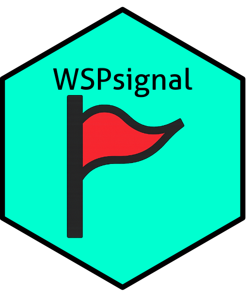

# WSPsignal 

The family of Weibull Shape Parameter (WSP) tests was developed to perform signal detection for adverse event monitoring based on electronic health records.

Most recently, the BPgWSP test was developed and presented in

Dyck, J., & Sauzet, O. (2024). **The BPgWSP test: a Bayesian Weibull Shape Parameter signal detection test for adverse drug reactions.** arXiv preprint arXiv:2412.05463.

available on [https://arxiv.org/abs/2412.05463](https://arxiv.org/abs/2412.05463)

triggering the effort to gather all WSP tests ready to apply in one package.

## Installation of the WSPsignal package
IN WORK: You can install the WSPsignal package with

``` r
# install.packages("devtools") # if not installed, yet
devtools::install_github(repo = "julia-dyck/WSPsignal")
```

## Reproduction of simulation study
To reproduce the simulation study presented in [Dyck & Sauzet (2024)](https://arxiv.org/abs/2412.05463) fork the repository, install the package with
``` r
Rcpp::compileAttributes(verbose = T) 
pkgbuild::compile_dll(force = T, debug = F) 
devtools::install_github(repo = "julia-dyck/WSPsignal") 
```
and apply commands in "WSPsignal/simulation_comparative/conduction_comp" (adjustment of file paths might be necessary, simulation can take long dep. on local device).

## Tuning of the PgWSP test for your purpose
To tune the PgWSP test for your application, you can use the folder in "WSPsignal/simulation_comparative" as template, and adjust sample scenarios, and test alternatives accordingly.

